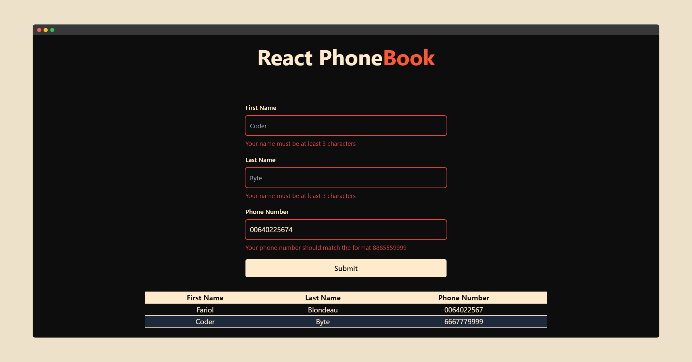

# React PhoneBook



React PhoneBook is a simple todo app in where you can save user by adding the first name, last name and phone number.

Tjis application is a good exemple for beginners because it illustrates how the `useState and useEffect` work in React.

All the contacts are stored inside the `localStorage`.

### Get Started

```bash

# cloning the repository
git clone https://github.com/bruxx-6243/react-phoneBook.git

# installing packages using pnpm
pnpm install

#starting the dev server
pnpm dev
```

### Features

- localStorage
- adding contact

### Technologies

- React TypeScript
- Tailwindcss
- Zustand (for the state management)
- zod (for the form validation)

### Deployment

This project is deployed on [netfliy](https://app.netlify.com/) and you can preview it by clicking [HERE](https://brx-hashcode-react-phonebook.netlify.app/)!
